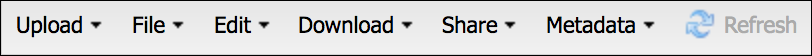

.. include:: cyverse_rst_defined_substitutions.txt
|CyVerse_logo|_

|Home_Icon|_
`Learning Center Home <http://learning.cyverse.org/>`_


Discovery Environment: Managing Data Files and Folders
-------------------------------------------------------
.. #### Comment: A major functionality is a heading for one or more functions
   grouped together from the point of view of the user. If you were writing a
   book (manual?) on the platform, these would be the headings.

   The first major recommended functionality are user settings and preferences
   Next are any important groupings, and these may correspond to major buttons
   on a dashboard or user interface.

The Discovery Environment provides an easy-to-use interface to files stored in
the CyVerse Data Store.

|DE Data Window|

Discovery Environment data window

----

Discovery Environment Data Window Menus: Upload, File, Edit, Download, Share, Metadata, Refresh
~~~~~~~~~~~~~~~~~~~~~~~~~~~~~~~~~~~~~~~~~~~~~~~~~~~~~~~~~~~~~~~~~~~~~~~~~~~~~~~~~~~~~~~~~~~~~~~~~

**Major Features**

- Upload and download of small (<1GB) files; import data from URLs
- Share data via URL or with other CyVerse users
- Apply and edit file metadata

**Menu items and functionalities**

|menu|

.. list-table::
    :header-rows: 1

    * - Menu heading
      - Menu subheadings and functions
    * - **Upload**
           .. tip::

               To upload large data sets (>1GB) we recommend using Cyberduck or
               iCommands. Instructions for using these tools are found in the
               |Data Store Guide|

      - - *Simple Upload*:
           Upload up to 5 small (<1.9 GB) files from your computer
        - *Bulk Upload from Desktop*:
            This function is deprecated - see |Data Store Guide| for updated
            instructions
        - *Import from URL*:
            Import data from up to 5 valid HTTP(S)/FTP URLs. There is no data
            limit, but import speed will generally be limited by network
            bandwidth
          - **Note**:
              Imported data will be deposited in the directory
              highlighted in the Navigation pane of the Data window
        - *Import Genome from CoGe*:
            Search for and import genome sequence from |CoGe|
    * - **File**
           .. tip::

               Files, folders, and other objects can only be created in
               locations on the data store where you have write or own permission
      - - *Create NCBI SRA Submission Folder*:
           This is a special format folder that allows you to create a
           submission to the NCBI Sequence Read Archive. See the |submission tutorial|
        - *New Data Window*:
           Open a new data window
        - *New Data Window at this location*:
           Open a new data window at the selected/highlighted location
        - *New Folder*:
           Create and name a new folder
        - **File templates**
            Click to create a new file in any of the following file formats:
          - *Plain Text file*
          - *Tabular Data file*
          - *New R Script*
          - *New R Script*
          - *Perl Script*
          - *New Shell Script*
          - *New Markdown*
          - *New HT analysis path list file*:
             Create a high-throughput analysis path list file for use in
             high-throughput and batch file execution
          - *New Multi-Input path list file*:
             Create a path file list for use in an application that take multiple
             inputs
          - *Automate path list file creation*:
             - Automate HT analysis path list file creation
                 Automatically create a list of files (from pattern match or
                 file format) for a High-throughput analysis.
             - Automate Multi-Input path list file creation
                 Automatically create a list of files (from pattern match or
                 file format) for a multi-input analysis.
        - *Move to Trash*:
           Move a selected file or folder to the Discovery Environment Trash.
    * - **Download**
          .. tip::

              To download large data sets (>1GB) we recommend using Cyberduck or
              iCommands. Instructions for using these tools are found in the
              |Data Store Guide|
      - - *Simple Download*:
           Download small (<1GB) individual files. Use Cyberduck or iCommands
           for large files or folders.
        - *Bulk Download*:
           This function is deprecated - see |Data Store Guide| for updated
           instructions
    * - **Share**
          .. tip::

              You can share any size file/any number of files instantly with
              other CyVerse users. See the |Data Store Guide|
      - - *Share with Collaborators*:
           Download small (<1GB) individual files. Use Cyberduck or iCommands
           for large files or folders.
        - *Create a Public Link*:
           This function is deprecated - see |Data Store Guide| for updated
           instructions
        - *Share Folder Location*:
           This function is deprecated - see |Data Store Guide| for updated
           instructions
        - **Visualizations**
            There are a number of common visualizations available
          - *View in CoGe*:
           View Fasta info-type genome files you own in CoGe
          - *View in Genome Browser*:
           View bam, vcf, gff, gtf, bigBed, and bigWig—genome files you own in
           the genome browsers at Ensembl, UCSC, IGV, GBrowse, jbrowse, and
           WashU EPIGenome Browser.
          - *View in Tree Viewer*:
           View newick info-type genome files you own in the Tree Viewer
    * - **Metadata**
          .. tip::

              See detailed instructions for working with Metadata in the
              Discovery Environment in the data store guide |metadata documentation|
      - - *Edit/View Metadata*:
           View and edit metadata for a file/folder
        - *Copy Metadata from*:
           Copy metadata from one file/folder to another
        - *Save Metadata to file*:
           Export metadata from a file/folder to an XML file
        - *Download Template*:
           Download template CSV files for various metadata formats/standards
        - *Apply Bulk Metadata*:
           Apply metadata to several files/folders at once
        - *Request DOI*:
           Request a permanent identifier for a data set
    * - **Refresh**
          .. tip::

              After performing file operations (importing, moving, rename, etc.)
              you may need to refresh to see changes
      - - *Refresh*:
           Reset your Data window view

File Operations Additional Details
````````````````````````````````````
**Creating an high throughput (HT) analysis path list**

You can create a high-throughput analysis path list file for use in
high-throughput and batch file execution. This allows you to feed a single file
that is **a list of up to 16 files** into an app that supports a single
file or single folder as input. The same analysis is then run concurrently on
the first 8 files in the list, with any subsequent files queued for later
submission. All files in the list must use the same parameters, and it is
available for all apps in the DE, including Agave apps.

Once you have created and saved your list file by dragging the files from the
Data list to the HT window, you can submit it as the input file in an analysis
using any app. You can check the status of each file in the list as it is
executed.

  1. In the Data window, click File, point to Create, and then click
     New HT Analysis Path List file.

  2. In the Data window, navigate to the first file to add to the list, and then
     drag it to the HT window. Repeat for each file to add to the list.
     All files must have the same parameters when you create the analysis.

  3. When the high-throughput list is complete, select the folder to which you
     want to save the file, click Save, and enter the filename (no spaces or
     special characters in the filename or folder). You can move it later if
     necessary.

  4. The file is displayed in the selected folder with an file list icon (|ht icon|)
     to the left of the name to indicate it is a high-throughput list file
     (you may need to refresh the window) and may now be used in an analysis,
     just like any other file. Submit the list file as the single input file in
     an analysis in any app. To view the status of each file's progress in the
     analysis, click Individual analysis status next to the analysis name in the
     Analyses window.

   .. tip::

      Each path from each HT list will be paired for each job, so each HT list
      used in an app must have the same number of paths. For example, if each
      HT list has 10 paths, 10 jobs will be run.

**Moving a file to trash**

Deleted items are moved to the Trash folder of the user who deleted them, and
that person is the only person who can restore or permanently delete it. You can
restore an item you deleted to the location in which it was stored before you
deleted it. When you know an item is no longer needed, you can either empty the
Trash folder to permanently delete all items in the list, or you can delete just
some of the items.

*Opening the Trash folder*


  1. In the Data Window, click Trash on the top right and then click Open Trash
     or Click the Trash folder in your Navigation list. The list of deleted
     files and folders is displayed.

     .. tip::

          When an item is moved to the Trash folder, additional random
          alphanumeric characters are added to the end of the name to
          distinguish it from other items with the same name, and an icon to
          the left shows a red minus sign

**Viewing Genome Files in a Genome Browser**

You can view bam, vcf, gff, gtf, bigBed, and bigWig—genome files you own in the
genome browsers at Ensembl, UCSC, IGV, GBrowse, jbrowse, the WashU EPIGenome
Browser. The files must be tagged with the info-type for that file. You also can
view genome files in CoGe and view Newick files in the Tree Viewer.

  1. Open the Data window and  find the bam, vcf, gff, btf, bed, bigBed, or
     bigWig file you own.

  2. Click the checkbox for the files to send.
  3. In the Details section on the right, verify that the Info-Type
     shows the correct type, and change the info-type if necessary.
  4. In the Details pane, click Genome Browser
  5. In the View in Genome Browser dialog Copy the URL that has been generated
     and click the link for the genome browser to use. Then click ok.
     If you have an issue importing into your choice of browser, you may need to
     change https:// to http:// in the URL.


----

Discovery Environment Data Window Menus: Search
~~~~~~~~~~~~~~~~~~~~~~~~~~~~~~~~~~~~~~~~~~~~~~~~

**Major Features**

- Simple search on text query
- Search on metadata
- Save search filters in a smart folder

**Menu items and functionalities**

|search|


**Simple Search**

To do a simple search on a file/folder name, enter your query into the search
box and hit enter. Enter at least 3 characters (case-insensitive) of the file or
folder name. The viewing pane displays the number of search results returned for
the query, and the name and path of each result.

**Advanced Search on Metadata**

To search on metadata or file parameters, click the magnifying glass icon (|mag icon|).
You can then build a query of one or more filters:

*ALL below or ANY below*
For each filter you add with the plus icon (|plus icon|), indicate if the search
must match any or all of the filters.

*Query Options*

You can search by any of the following:

- File/folder name
- File/folder owner
- File/folder path
- Creation date
- Modification date
- Tags
- File size
- Metadata values/attributes
- Permissions

Add additional search filter parameters by pressing the plus icon (|plus icon|)
or remove parameters by pressing the deletion icon (|delete icon|).


**Save Search Filters**

For any advanced search queries, you can click :guilabel:`&Save` to save queries
into a smart folder. Future items matching those search parameters will be
linked as shortcuts in the smart folder. The smart folder will appear in the
Data window's navigation pane with a "red x" icon. Click this icon to remove the
saved search (files/folders in this folder will not be deleted, but will remain
in their original locations).


----

Discovery Environment Data Window Menus: Navigation
~~~~~~~~~~~~~~~~~~~~~~~~~~~~~~~~~~~~~~~~~~~~~~~~

**Major Features**

- Navigate file system
- Access shared data and Data Commons data
- Access favorites and saved search filters

**Folder descriptions**

|search|


----

[Platform] Sub-functionality n
~~~~~~~~~~~~~~~~~~~~~~~~~~~~~~~
|menu|

Short introductory text here.

[Platform] menu, panel, or console
````````````````````````````````````
[Optional Photo]

**Major Features**

- Feature 1
- Feature 2
- Feature 3

**Menu or panel heading**

Introductory text

.. list-table::
    :header-rows: 1

    * - Menu heading
      - Functionality
    * - Menu title
      - Function explanation

.. tip::
          Helpful tips


----


..
	#### Comment: Suggested style guide:
	1. Steps begin with a verb or preposition: Click on... OR Under the "Results Menu"
	2. Locations of files listed parenthetically, separated by carets, ultimate object in bold
	(Username > analyses > *output*)
  3. For clickable buttons use ":guilabel:`&button_name`." to render a button with 'button_name'
  4. Keywords in bold: Click on **Apps** OR select **Arabidopsis**
	5. Primary menu titles in double quotes: Under "Input" choose...
	6. Secondary menu titles or headers in single quotes: For the 'Select Input' option choose...
	####


----

**Fix or improve this documentation**

- Search for an answer:
  |CyVerse Learning Center|
- Ask us for help:
  click |Intercom| on the lower right-hand side of the page
- Report an issue or submit a change:
  |Github Repo Link|
- Send feedback: `Tutorials@CyVerse.org <Tutorials@CyVerse.org>`_


- Live chat/help: Click on the |intercom| on the bottom-right of the page for questions on documentation

----

|Home_Icon|_
`Learning Center Home <http://learning.cyverse.org/>`_


.. Comment: Place Images Below This Line
   use :width: to give a desired width for your image
   use :height: to give a desired height for your image
   replace the image name/location and URL if hyperlinked


 .. |Clickable hyperlinked image| image:: ./img/IMAGENAME.png
    :width: 500
    :height: 100
 .. _CyVerse logo: http://learning.cyverse.org/

 .. |Static image| image:: ./img/IMAGENAME.png
    :width: 25
    :height: 25





.. Comment: Place URLS Below This Line

   # Use this example to ensure that links open in new tabs, avoiding
   # forcing users to leave the document, and making it easy to update links
   # In a single place in this document

   .. |Substitution| raw:: html # Place this anywhere in the text you want a hyperlink

      <a href="REPLACE_THIS_WITH_URL" target="blank">Replace_with_text</a>


.. |CoGe| raw:: html

   <a href="https://genomevolution.org/coge/" target="_blank">CoGe</a>

.. |submission tutorial| raw:: html

   <a href="https://learning.cyverse.org/projects/sra_submission_quickstart/en/latest/" target="_blank">submission tutorial</a>

.. |metadata documentation|  raw:: html

   <a href="https://cyverse-data-store-guide.readthedocs-hosted.com/en/latest/step3.html" target="_blank">metadata documentation</a>

.. |Github Repo Link|  raw:: html

   <a href="FIX_FIX_FIX_FIX_FIX_FIX_FIX_FIX_FIX_FIX_FIX_FIX_FIX_FIX_FIX" target="blank">Github Repo Link</a>
