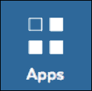

.. include:: cyverse_rst_defined_substitutions.txt
|CyVerse_logo|_

|Home_Icon|_
`Learning Center Home <http://learning.cyverse.org/>`_


Discovery Environment: DE Interface Basics
-------------------------------------------

The Discovery Environment has four main functionalities Data management and
sharing (Data), Applications (Apps) and Analysis history (Analyses). The
Visual Computing Interactive Environment (VICE) is a special application within
Apps that allows you the flexibility of Jupyter Labs (i.e. Jupyter notebooks for
Python and R applications). These section will introduce preferences and
notifications.

|DE Main|

----

Discovery Environment: Notifications, Preferences, Help
~~~~~~~~~~~~~~~~~~~~~~~~~~~~~~~~~~~~~~~~~~~~~~~~~~~~~~~~~

The following icons (Discovery Environment: upper-right)
will allow you to see the status of jobs, set preferences,
and get help.

|Notifications| **Discovery Environment: Notifications**
``````````````````````````````````````````````````````````
.. list-table::
    :header-rows: 1

    * - Functionality and notes
      - Sub-functionalities
    * -  - Status of analysis jobs launched in the DE
         - Data you shared or shared with you.
         - Available VICE jobs
      - From notification you can see all past notifications, filter and search
        on notifications or delete notifications

|Preferences| **Discovery Environment: Preferences**
``````````````````````````````````````````````````````````
.. list-table::
    :header-rows: 1

    * - Primary Functionalities
      - Sub-functionalities
    * - Set default behaviors and notification preferences
      - **General Preferences**
          - Set default file paths and data window behaviors, set keyboard
            shortcuts. Reset HPC tokens.
        **Notification Preferences**
          - Set email notification preferences. Add Webhooks, add additional
            notifications (Data/App sharing, analysis status changes, identifier
            requests, teams).
        **Collaboration**
          - *Collaborators*:
            Search for and add collaborators (other CyVerse users) in a list of
            favorites.
          - *Teams*:
            Create teams of users for easy sharing and permission handling
        **User Manual**
          - User manual
        **Introduction**
          - Automated-guided Discovery Environment tour
        **About**
          - Platform release information and citation
        **Logout**
          - Platform logout

|Help| **Discovery Environment: Help**
``````````````````````````````````````````````````````````
.. list-table::
    :header-rows: 1

    * - Primary Functionalities
      - Sub-functionalities
    * - Quick reference to help documentation
      - **FAQs**
          - Link to Frequently Asked Questions
        **Forum**
          - Link to CyVerse User's Forum
        **Feedback**
          - Feedback form/survey


.. tip::
          In the **General Preferences** menu you can set the location of
          of your "Default analysis output folder." If you set it to a
          directory that is shared with collaborators, you can be sure that
          all the outputs of an analysis are automatically shared with the
          collaborators who have folder access.

----

Discovery Environment: Data, Apps, Analyses Panels
~~~~~~~~~~~~~~~~~~~~~~~~~~~~~~~~~~~~~~~~~~~~~~~~~~~
The Environment is set up like a virtual "Desktop" with three primary functions:

 - **Data**: File browser, sharing, and metadata management
 - **Apps**: Catalogue of applications, new application and simple workflow
   creation
 - **Analyses**: Status and history of analysis jobs.


|data_icon| **Discovery Environment: Data Panel**
``````````````````````````````````````````````````
.. list-table::
    :header-rows: 1

    * - Primary Functionalities
      - Sub-functionalities
    * - Manage data, metadata, and sharing
      - - Upload/download/import files
        - Create/move/rename/tag files and folders
        - Share and access shared files (data commons)
        - View files (for specific file formats)
        - Apply and edit metadata
        - Search for files

.. tip::
          Since the Discovery Environment operates over standard web protocols,
          data upload/download slow. We suggest uploading and downloading
          large datasets (> 1GB) using Cyberduck or iCommands; see the |Data Store Guide|.

-----

|apps_icon| **Discovery Environment: Apps Panel**
```````````````````````````````````````````````````
.. list-table::
    :header-rows: 1

    * - Primary Functionalities
      - Sub-functionalities
    * - Bioinformatics applications/application and workflow development
      - - Search for and use applications
        - Create and edit applications
        - Create and edit simple workflows
        - Share and create public applications
        - Add and request Dockerized tools or other source code/binaries


.. tip::

        Don't see a tool you'd like to use? You can submit a Dockerfile or the
        URL of a binary or source code to have it made available in the DE.


-----

|analyses_icon| **Discovery Environment: Analyses Panel**
```````````````````````````````````````````````````````````
.. list-table::
    :header-rows: 1

    * - Primary Functionalities
      - Sub-functionalities
    * - Job management and history
      - - See the status of analysis jobs
        - Cancel or relaunch jobs
        - Access and export job history and parameters

.. tip::

         You can relaunch a job with previously used parameters without the need
         to renter parameters one-by-one.


..
	#### Comment: Suggested style guide:
	1. Steps begin with a verb or preposition: Click on... OR Under the "Results Menu"
	2. Locations of files listed parenthetically, separated by carets, ultimate object in bold
	(Username > analyses > *output*)
  3. For clickable buttons use ":guilabel:`&button_name`." to render a button with 'button_name'
  4. Keywords in bold: Click on **Apps** OR select **Arabidopsis**
	5. Primary menu titles in double quotes: Under "Input" choose...
	6. Secondary menu titles or headers in single quotes: For the 'Select Input' option choose...
	####


----

**Fix or improve this documentation**

- Search for an answer:
  |CyVerse Learning Center|
- Ask us for help:
  click |Intercom| on the lower right-hand side of the page
- Report an issue or submit a change:
  |Github Repo Link|
- Send feedback: `Tutorials@CyVerse.org <Tutorials@CyVerse.org>`_


- Live chat/help: Click on the |intercom| on the bottom-right of the page for questions on documentation

----

|Home_Icon|_ `Learning Center Home <http://learning.cyverse.org/>`_


.. Comment: Place Images Below This Line
   use :width: to give a desired width for your image
   use :height: to give a desired height for your image
   replace the image name/location and URL if hyperlinked


 .. |Clickable hyperlinked image| image:: ./img/IMAGENAME.png
    :width: 500
    :height: 100
 .. _CyVerse logo: http://learning.cyverse.org/

 .. |Static image| image:: ./img/IMAGENAME.png
    :width: 25
    :height: 25


.. |Help| image:: ./img/de/help_icon.png
   :width: 50
   :height: 50





.. Comment: Place URLS Below This Line

   # Use this example to ensure that links open in new tabs, avoiding
   # forcing users to leave the document, and making it easy to update links
   # In a single place in this document

   .. |Substitution| raw:: html # Place this anywhere in the text you want a hyperlink

      <a href="REPLACE_THIS_WITH_URL" target="blank">Replace_with_text</a>


.. |Github Repo Link|  raw:: html

   <a href="https://github.com/CyVerse-learning-materials/discovery_environment_manual" target="blank">Github Repo Link</a>
